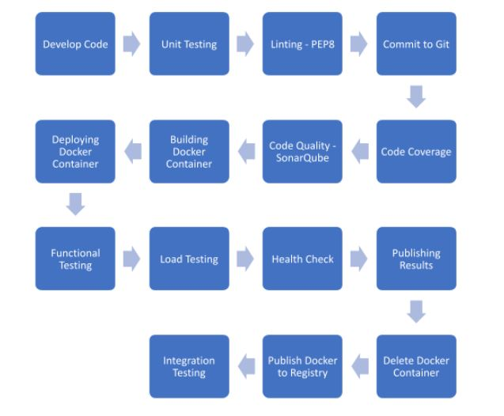
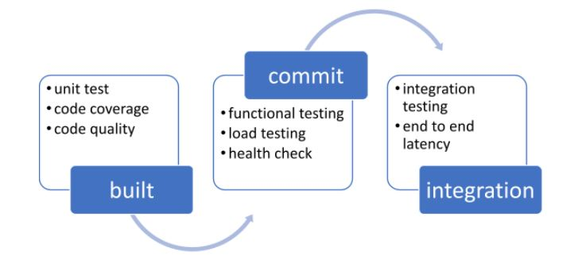
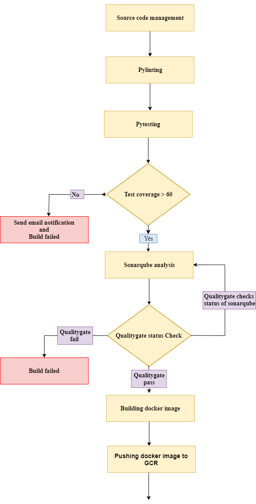
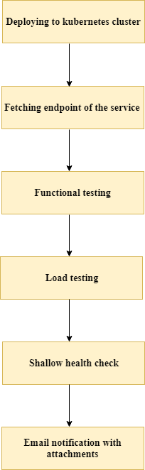

# Quality Assurance

## Objective

1. To build an automated system for build and deployment on a multi-cloud platform
2. To encourage the developers to write good quality code
3. To implement test-driven development
4. To identify the developers who write good quality code
5. To build a secure platform for deploying the applications to various environment
6. A platform for load testing
7. A platform for integration testing

## Development Lifecycle

### Develop Code

1. The developer can use any platform to develop the code. We recommend using Pycharm from JetBrains.
2. Use the virtual environment for dependency management
3. Make sure to add the dependencies in requirements.txt file with version number

### Unit Testing

1. Make sure to include unit test cases for every module
2. Write unit test cases for the positive and negative scenario
3. Use unittest module for unit testing - [https://docs.python.org/3/library/unittest.html](https://docs.python.org/3/library/unittest.html)

### Linting – PIP8

1. Enable Pylint for checking PIP 8 standard
2. Enable Pylint real-time scanning
3. Set Pylint severity to warning

### Commit to Git

1. Never commit to master
2. Always make a new branch with feature name to add new features
3. After a successful functional test merge with integration branch
4. After successful integration test merge with release branch
5. After successful production deployment merge with master branch

### Code Coverage

1. Jenkins will poll the changes from the git and execute the unit test cases.
2. Jenkins will reject the code if the code coverage is below 60%, and send an automated mail to the developer.
3. If the code coverage is satisfied Jenkins will publish the source code to sonar cube

### Code Quality – SonarQube

1. SonarQube will analyze the quality of the code
2. SonarQube will identify bugs, code smells, security vulnerability and report to the user
3. It will explore all the execution paths for quality check
4. Share the quality report to developer
5. Package the code, artifacts and move to build folder with version

### Building Docker Container

1. If the code quality is passed, Jenkins will build the docker container and publish the latest version to google docker register with the tag &#39;built/&#39;
2. It will install all the python dependencies from requirements.txt
3. It will install the software dependencies from packages.txt

### Deploying the docker container

1. Deploy the latest docker build to Kubernetes cluster using helm charts
2. Use python decorators to specify whether its API endpoint or batch job
3. Get the endpoint and pass to functional testing

### Functional Testing

1. Tests the end to end functionality of the API
2. Use unittest module to implement functional testing
3. A Functional test should have a positive scenario and negative scenario
4. Jenkins will invoke the endpoint to do the testing
5. Functional test will record the latency for one request, reject the code if it is below threshold – 100 milli seconds.
6. Send functional test report to the developer

### Load Testing

1. Locust is used for load testing
2. Load testing is executed against one pod with specified resources in the helm chart
3. Identify the number of request API can handle. Also record the failed scenarios, request per second and average latency
4. Share the results with developer

### Health Check

1. Test the shallow health check of the deployed API – ping pong
2. Test the deep health check of the deployed API
3. Reject the code if it doesn&#39;t have a health check

### Publish Reports

1. Jenkins will consolidate the reports from functional test, load test and share it with the bigger audience (Lead / Product owner)
2. Jenkins will also store one version of the results in the server

### Delete Docker container

1. After publishing the report delete all the resources created by the API
2. Delete the docker container
3. Package the code, artifacts and move to acceptance folder with the version
4. Publish the docker container to google registry with tag &#39;acceptance/&#39;

### Integration Testing

1. Integration testing will be executed once every two weeks
2. It will deploy all the applications from the acceptance folder using helm charts
3. Integration testing will be executed – End to end application testing
4. Share the Integration test results and latency report to the larger audience
5. After successful integration test move the artifacts to QA folder with the version

## Movement of artifacts

All the artifacts will be stored in Google cloud storage with versions

## Environments

Quality assurance will be guaranteed by deploying the application in three different environments

1. DEV
    1. Built, commit and integration testing will be executed in the development environment
    2. End to end functionality will be tested using mock data
    3. Testing will be executed with limited infrastructure
    4. Have SSH access
2. QA
    1. Lead can deploy / redeploy the infrastructure
    2. Testing will be done by business
    3. Actual data is used for testing
    4. Infrastructure will be same as prod
    5. Developers don&#39;t have access to QA, exceptions can be given for debugging the issues
    6. Limited SSH access
    7. No access to databases
    8. All the security checks will be done in QA
3. Prod
    1. No access to developers
    2. No SSH access
    3. No access to databases
    4. Only product owner can deploy / redeploy the infrastructure
    5. All the infrastructure and application should be monitored

## Flow Diagram

   
