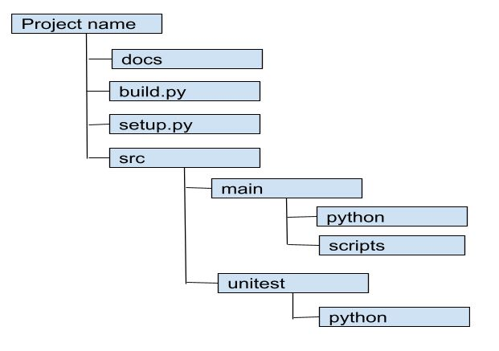

# **Documentation**

## **Environment Setup**

- Create a GCP VM instance with Ubuntu 18.04 as a base image, 2v CPU&#39;s,7.5 GB memory(at least 6GB is required).
- Software installed on VM server instance are Jenkins, SonarQube, Locust, Docker, Git, Kubectl, Helm Charts, etc.,
- Configure Network Firewall rule to allow ports 8080,9000,8089 to access default ports of Jenkins, Sonarqube, Locust.
- To integrate Jenkins with other services like Sonarqube, Kubernetes, Git, Google OAuth, Google Container Registry, etc., install required plugins from the Manage Plugins section.
- To integrate Jenkins with Sonarqube, create an access token in the security section of Sonarqube and create Jenkins Global credentials of type Secret text using the access token.
- To integrate Jenkins with Gitlab, create credentials of type Username and password in Jenkins Credentials section.
- To integrate Sonarqube with Jenkins, mention the Jenkins URL in the webhooks section of the Sonarqube.
- To publish the docker image to GCR and to create Kubernetes deployments and services, a google service account with sufficient permissions to access Kubernetes, cloud storage, compute engine should be created.
- Download the private key of the service account in JSON format while creating it. A new credential in Jenkins of the type &#39;Google service account from private Key&#39; has to be created and uploaded.
- A Kubernetes GKE cluster with 1 node having 3.75GB memory is created.
- In the Global Tool Configuration of Jenkins, specify Sonarqube server URL, access token. Install Sonar Scanner to do analysis and its installation path should be set in Configure System under Manage Jenkins section.
- Create two Gmail app passwords to configure Email notifications from Jenkins and Sonarqube.
- DNS: Using AWS Route53 the domain name jenkins.qdatalabs.com is created and attached to the VM instance. This is done by creating a recordset jenkins.qdatalabs.com to the existing hosted zone qdatalabs.com.
- Jenkins Google Authentication: A set of credentials (client id &amp; client secret) are created in the Google Developers Console. They should be specified in the Configure Global Security section of Jenkins. Log in with the Google option has to be selected.

## **Pybuilder :**

- Pybuilder is a software build tool. Created python folder structure using pybuilder.
- Implemented **setup.py** , and used it to create a python tar file.
- Used pybuilder to automatically execute unit and integration tests on every build.
- Used it for automatic analysis of code coverage and automatically generated distutils script setup.py

## **Structure :**

**Designing Pybuild Structure**

- Create project folder

**mkdir project\_name**

**cd project\_name**

- Install Pybuilder

**pip install pybuilder**

- Create folder structure

**pyb --start-project**

- Install dependencies

**pyb install\_dependencies**

- Verify test

**pyb verify**

- Run pybuilder

**pyb**

## **Jenkins pipeline**

**Jenkins** is used to achieve the CI/CD process.

**Prerequisites** :

Install the latest java version, Jenkins, Git on Compute Engine instance.

### **Pipeline Stages** :

- **SCM checkout**
- **Pylint**
- **Pytest**
- **code coverage**
- **Sonarqube**
- **creating docker image**
- **Push docker image to GCR**
- **Deployment in GKE using Helm charts**
- **Wait for External IP of Kubernetes service**
- **Functional testing**
- **Load testing**
- **Shallow health check**
- **Email notification**
- **Deleting the infrastructure**

**SCM checkout :**

- The folder structure created using pybuilder is pushed to the git repository.
- Install GitHub API plugin.
- Git repo is integrated with Jenkins in the Source Code Management section of the pipeline by providing **Git URL and branch.**
- In the Jenkins credentials section, provide **git username and password.**
- Configure **Git Webhooks** to trigger Jenkins job/pipeline as soon as a developer commits code to the Git repo.

**Pylint**

- Pylint is a tool that analyses python modules for coding standards( **PIP8** ).
- It provides descriptive and accurate reports about statistics like **code duplications, errors, and warnings by module.**
- It gives a rating to your code on a scale of **10.**
- Suggests writing docstrings for classes and functions.

**Pytest**

- Pytest is a Python-based testing framework to write and execute test cases.
- Pytest has its own way to detect the test file and test functions automatically, if not mentioned explicitly.
- Pytest can run multiple tests in parallel, which reduces the execution time of the test suite.
- Pytest allows us to skip a subset of the tests during execution.

**Code coverage**

- **The coverage** tool analyses the source code and gives **Pytest** coverage percentage.
- Jenkins will reject the code and fail the pipeline if the code coverage is below 60%, and send an automated mail to the developer.
- If the code coverage is satisfied Jenkins will publish the source code to sonarqube.

**SonarQube**

- SonarQube will analyze the quality of the source code(static code analysis).
- It can integrate with existing workflow to enable continuous code inspection across your project branches and pull requests.
- SonarQube will identify bugs, code smells, security vulnerabilities and report to the user
- It will explore all the execution paths for quality check
- Share the quality report to developer
- Fail the pipeline if the quality is below the threshold
- Install Sonarqube on GCP VM instance and configuration settings are made in sonar.properties file. Also, install Sonar-Scanner in order to make an analysis.
- In order to integrate sonarqube with Jenkins, In the Manage Jenkins section, configure the sonarqube server properties.
- Then, configure the sonar scanner installation path in the Global Tool Configuration of Jenkins.
- By default, sonarqube runs on port 9000 on the VM instance and its UI can be seen there.

**Quality Gate**

- Quality Gates define a set of rules to be configured along with certain threshold limits. If any rule is failed, the quality gate will be failed.
- The rules can be like the min % of code coverage, code smells, code duplicacy, etc.
- Define Project Name, Project Key, Language, file sources to be analyzed, set of rules in the Quality gate, quality profile for analysis.
- After analysis, sends a report in the form of an email to developers.
- For this, configure the SMTP server for GMAIL in the settings.
- For users with Gmail, two-factor authentication turned on configure GMAIL APP PASSWORDS.

**Quality Gate status check:**

- Publishing source code to sonarqube might take some time for analysis and to generate reports.
- This stage checks whether the quality gate is passed or not. If the quality gate is passed, it goes to the next stage in the pipeline, otherwise, the build will be failed.
- Quality Gate will fail when any of the rules don&#39;t reach expected values.

**Building docker image and pushing it to GCR:**

Docker is a containerization tool that packages the application and along with dependencies.

- Docker image is built using Dockerfile.
- Docker image is the template that is used to run the containers.
- If the code quality is passed, Jenkins will build the docker container and publish the latest version to the google container registry(GCR)
- It will install all the python dependencies from requirements.txt

**Kubernetes deployment:**

The Google Kubernetes Engine(GKE) service is used for Deployments.

Our app runs inside the pods and the service object provides the stable API endpoint to it. Services update when changes are made to pods, so they maintain an up-to-date list of pods running an application.

Deployments are sets of identical pods. All pods run the same application because they are created using the same pod template.

- Deploy the latest docker build to Kubernetes cluster using helm charts
- Create Kubernetes cluster with the required number of nodes in the node pool
- Connect to it with the gcloud cluster get credentials... Command.
- Create two YAML files, one for creating a deployment and the other for service (Load Balancer) specifying the required parameters like a number of pods, deployment name, type &amp; name of service, etc., So deployment and service can be created.
- Get the endpoint and pass it to functional testing

**Helm charts**

Helm Charts are used for creating deployments &amp; services in GKE. The **values.yaml** file is automatically populated every time by taking the parameters from the decorator. The templates like **deployment.yaml, service.yaml** etc., take the required parameters from values.yaml file.

The parameters required to create **values.yaml** file are passed using a decorator. The default values are already specified. If a developer passes any parameter with a value that is different from the default value, it overrides the default value.

**Waiting for external IP :**

- Once the service is created, it takes some time nearly 20-30s for the External IP to get assigned.
- Then External IP is used for further stages like functional testing &amp; Load testing.
- For the External IP purpose, developed the shell script to wait for the stage until external IP gets assigned.

**Functional Testing**

- The endpoint of the service is fetched dynamically every time when Jenkins triggers the endpoint for functional testing.
- Tests the end to end functionality of the API
- Functional tests are executed against the deployed API using the unit test module.

**Load Testing**

- **Locust** framework is used for load testing.
- The total no. of users and the no. of users hitting the endpoint per second are virtually simulated.
- Write locust file for the application to which load testing is to be done.
- Load testing is executed against one pod with specified resources in the helm chart.
- A pod of size &#39;100m&#39; is able to handle 110 requests per second successfully.
- The analysis includes no. of failed requests, no. of successful requests, the latency of each request (Avg., Median, Max), etc.
- By default Locust runs on port 8089. The results can be downloaded in CSV format and shared with the developer.

**Shallow health check**

Health checks detect errors and identify when a service needs to be recreated.

- Test the shallow health check of the deployed API.
- Exposed the health check endpoint, time out is set to 100ms per request(latency per request). If the server does not respond within this time period, the Timeout exception is raised.
- Reject the code if it doesn&#39;t have a health check.

**Publish all the reports in the mail**

Jenkins will consolidate the reports from Pylint, functional test, load test and send them to the developers as an email attachment.

**Deleting the infrastructure :**

After publishing the report, delete all the resources created by the API, delete the docker container, package the code, artifacts and move to the acceptance folder with the version and publish the docker container to google registry with tag &#39;acceptance/&#39;.

